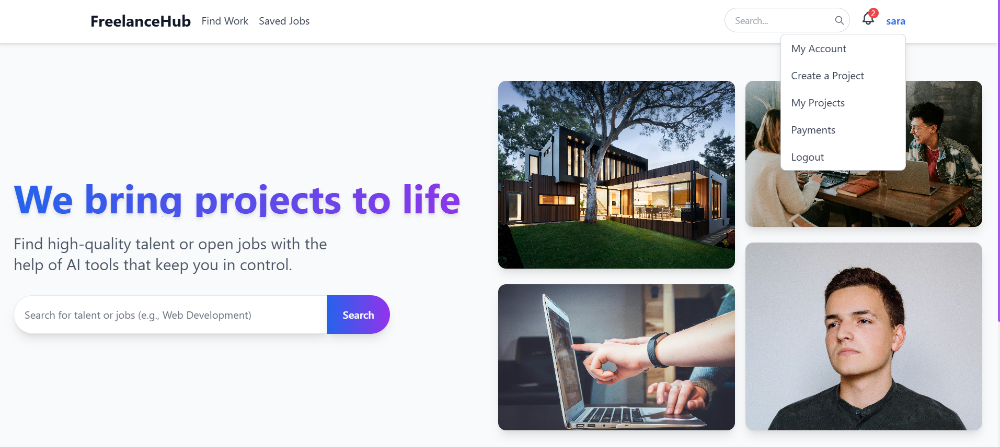
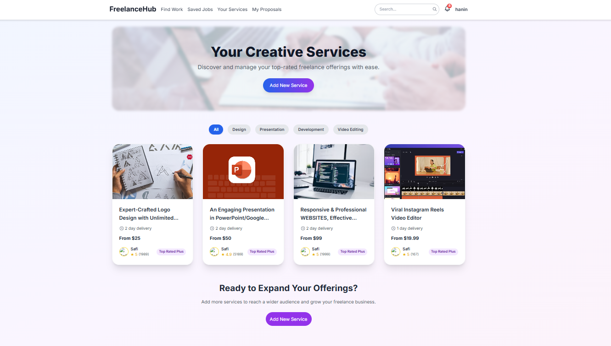
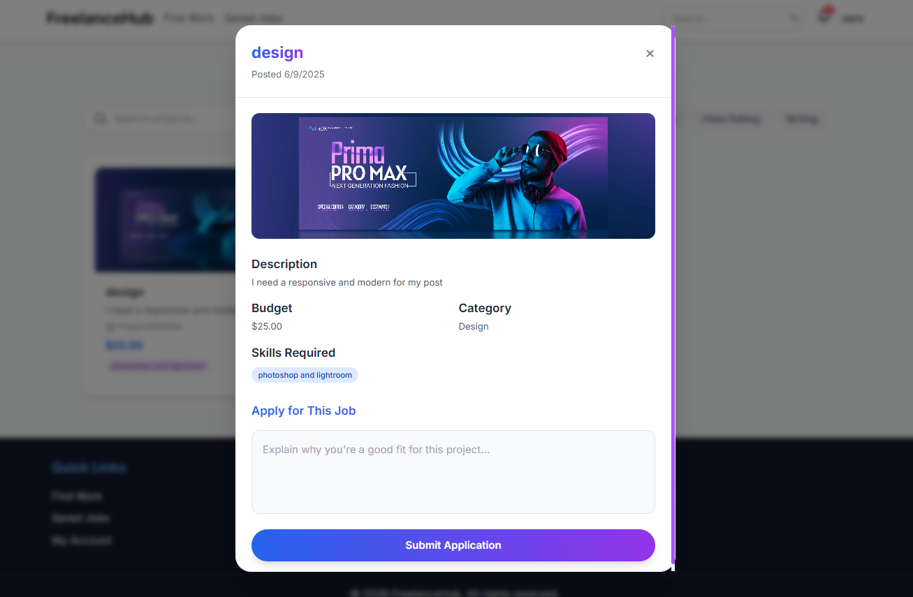
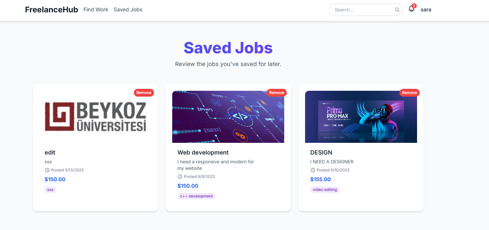
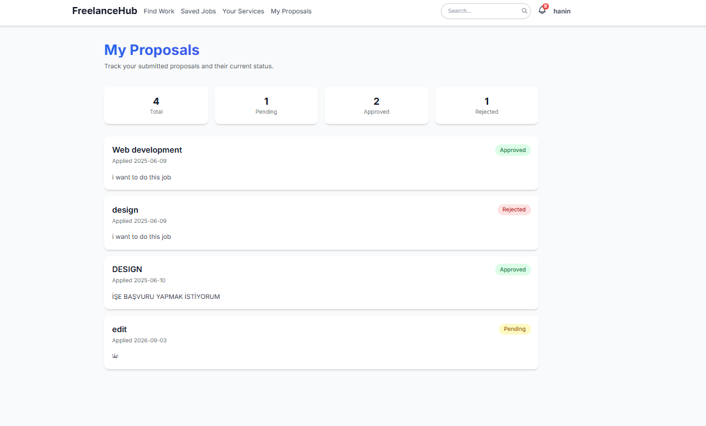
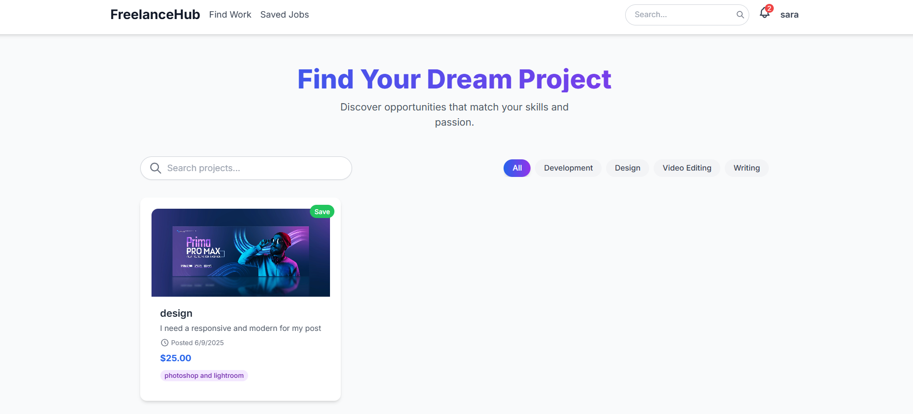
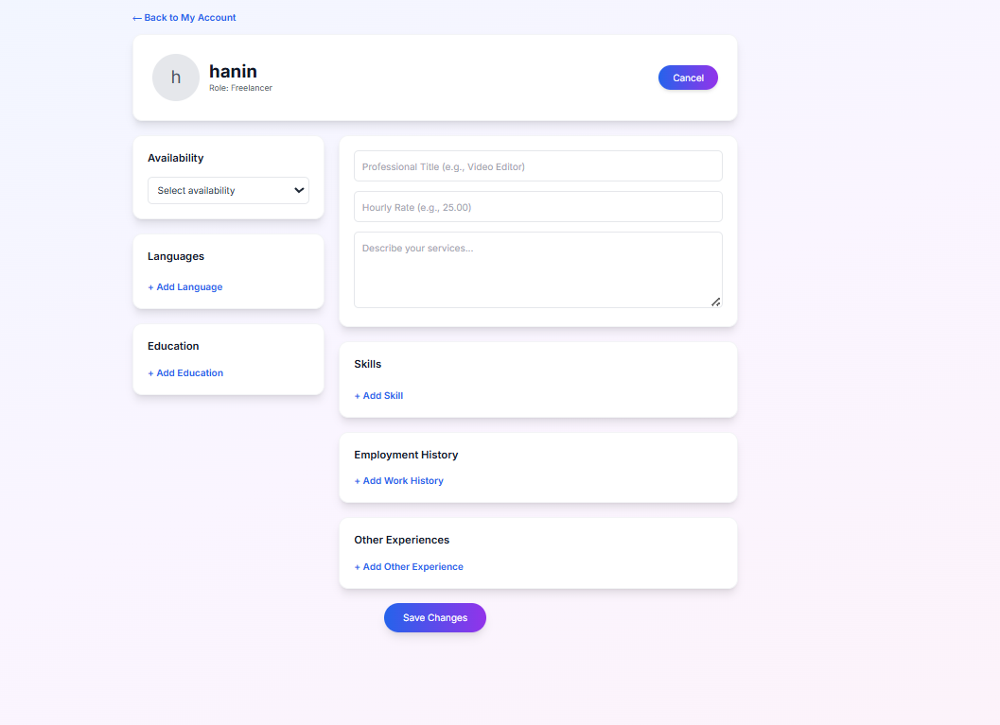
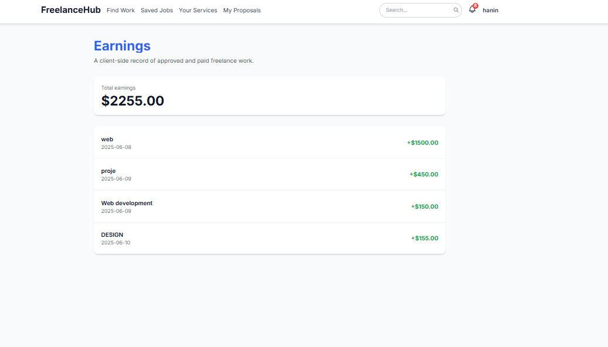

# FreelanceHub

<p align="center">A modern two-sided freelance marketplace frontend prototype built with React, Vite, Tailwind CSS, React Router, and Framer Motion.</p>

<p align="center">
  
  
  
  
</p>

<p align="center"><a href="README_TR.md">Türkçe README</a></p>

## Overview

**FreelanceHub** is a two-sided freelance marketplace prototype with two distinct role-based experiences: **Client / Job Poster** and **Freelancer**. Clients can publish and manage projects, review applications, communicate with candidates, approve or reject proposals, and manage simulated payments. Freelancers can discover opportunities, save jobs, submit and track proposals, manage their professional profile and services, and review earnings.

> **Scope:** This is a frontend/client-side prototype. Authentication, marketplace data, messages, earnings, and payments are simulated in the browser with `localStorage`. No production backend, database, payment gateway, or secure authentication service is connected.

## Product Showcase

<p align="center"></p>

## Two Role-Based Experiences

### Client / Job Poster

`Sign Up / Login → Create Project → Receive Applications → Review Proposal → Message Freelancer → Approve / Reject → Simulated Payment → Payment History`

### Freelancer

`Sign Up / Login → Find Work → Save / Open Project → Submit Proposal → Track Proposal → Message Client → Approval → Earnings History`

### Discover & Apply

<table><tr><td width="50%"></td><td width="50%"></td></tr><tr><td align="center"><b>Find Work</b></td><td align="center"><b>Project Application</b></td></tr></table>

### Save & Track Opportunities

<table><tr><td width="50%"></td><td width="50%"></td></tr><tr><td align="center"><b>Saved Jobs</b></td><td align="center"><b>My Proposals</b></td></tr></table>

### Freelancer Business Tools

<table><tr><td width="50%"></td><td width="50%"></td></tr><tr><td align="center"><b>Services</b></td><td align="center"><b>Professional Profile</b></td></tr></table>

### Earnings

<p align="center"></p>

## Core Features

- Role-based signup and navigation for clients and freelancers
- Client-side login and protected routes
- Project creation and project management
- Job discovery with search and category filtering
- Saved jobs and proposal submission
- Duplicate-application protection and proposal status tracking
- Client review, approval, rejection, and prototype messaging flows
- Simulated payment approval flow
- Freelancer earnings and client payment history
- Notifications, profile, account, and service management
- Responsive Tailwind CSS interface with Framer Motion animations

## Technology Stack

| Area | Technology |
| --- | --- |
| Frontend | React 19 |
| Build Tool | Vite 6 |
| Styling | Tailwind CSS 3 |
| Routing | React Router 7 |
| Animation | Framer Motion |
| State / Persistence | React state + browser `localStorage` |
| Linting | ESLint |

## Main Routes

| Route | Purpose |
| --- | --- |
| `/` / `/home` | Marketplace landing page |
| `/login` / `/signup` | Authentication and role-based registration |
| `/find-work` | Browse and search projects |
| `/saved-jobs` | Saved opportunities |
| `/create-project` | Client project creation |
| `/my-projects` | Client project/application management |
| `/my-proposals` | Freelancer proposal tracking |
| `/my-service` | Freelancer service management |
| `/profile` | Freelancer profile |
| `/earnings` | Freelancer earnings history |
| `/payments` | Client payment history |

## Run Locally

```bash
git clone https://github.com/safialajati2-creator/freelancehub.git
cd freelancehub
npm install
npm run dev
```

Production build:

```bash
npm run build
npm run preview
```

## Current Limitations

This project focuses on frontend architecture and product workflows rather than production infrastructure. Authentication is simulated, browser-stored passwords are not secure for production, data is device-local, messaging is not realtime, and payments do not transfer real money. A production implementation would require a backend API, database, secure authentication and authorization, server-side validation, file storage, realtime messaging, and a real payment provider.

## What This Project Demonstrates

FreelanceHub demonstrates practical frontend development across **routing, reusable components, role-based UX, form handling, browser persistence, project and application workflows, search and filtering, responsive UI design, and state-driven interface behavior**.

## Developer

**Mustafa Alajati**  
Software Developer — Istanbul, Türkiye  
[GitHub](https://github.com/safialajati2-creator) · [LinkedIn](https://www.linkedin.com/in/safi-alajati-8a1aa4286/) · [Email](mailto:alajati8@gmail.com)
